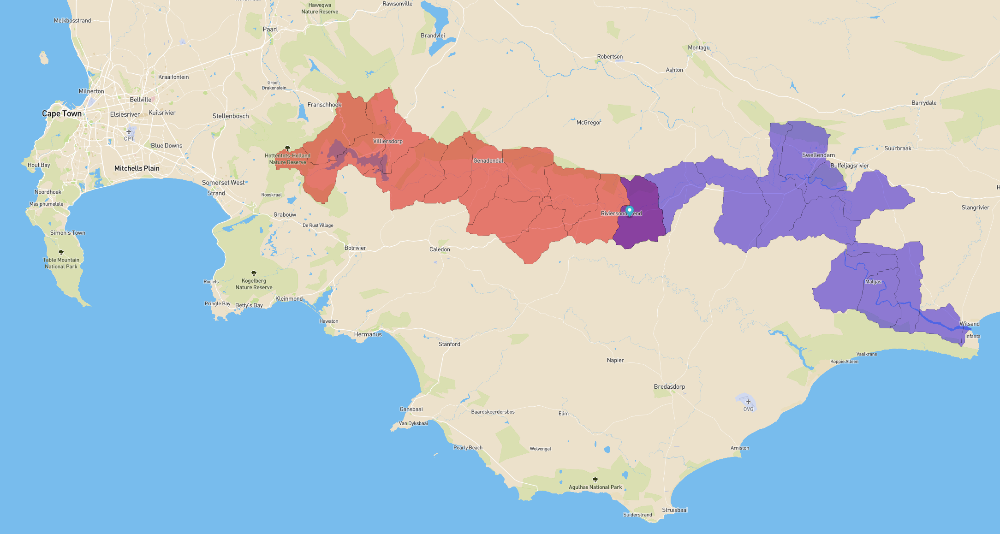

# water

[Watersheds Explorer](https://water.rdrn.me/) (which needs a better name) is probably the first interactive tool that can instantly tell you both the upstream watershed/drainage basin and downstream runoff of any point on Earth.

The river basin graph (1 million nodes) is in a Neo4j database served via a Flask app and NGINX. With a lat-lon or ID query, this calculates the IDs of all of the upstream and downstream basins, but doesn't have any geometry apart from bounding boxes. So the 1 million basin geometries are hosted as vector tiles on Mapbox. The frontend code does as much of the heavy lifting as possible by figuring out which basin ID is clicked on, and then colouring in the correct geometries based on the IDs returned by the API.

It looks like this:


# Setup
This is not intended to let you set this up (it's probably not enough information) but for me to remember it!

## Neo4j
Follow [these instructions](https://debian.neo4j.com/) for installing and running Neo4j on Debian/Ubuntu:
```
curl -fsSL https://debian.neo4j.com/neotechnology.gpg.key | sudo apt-key add -
sudo add-apt-repository "deb https://debian.neo4j.com stable latest"
sudo apt update
sudo apt install neo4j
sudo systemctl enable neo4j
```

You can log in to the database using `cypher-shell`, where the default username/password is `neo4j`/`neo4j` and you'll be prompted to create a new password. You can also load the web interface at (probably) [http://localhost:7474/browser/](http://localhost:7474/browser/).

Neo4j data (on Ubuntu) lives in `/var/lib/neo4j/`. The default import location (for CSVs) is `/var/lib/neo4j/import` and the config file is at `/etc/neo4j/neo4j.conf`. I had to bump `dbms.memory.heap.max_size` to get the CSV import to work. Probably need to `sudo systemctl restart neo4j` to reload config.

You can check that config has loaded:
```
cypher-shell
>>> CALL dbms.listConfig() YIELD name, value
    WHERE name STARTS WITH 'dbms.memory'
    RETURN name, value;
```

## HydroBASINS
The river basin data comes from [HydroSHEDS](https://hydrosheds.org/). I downloaded the highest Pfafstetter level for all continents, merged them into a single layer, added min/max bounds as separate columns to each geometry, and then exported (without geometry) as a CSV.

I also exported (with only geometry and basin ID) as `GeoJSON` and converted to MBTiles as follows:
```
tippecanoe -o basins.mbtiles -Z4 -z7 -l basins -f basins.geojson
```

There's a fair chance this will be too big to work with Mapbox's web upload, so you'll need to use the [Uploads API](https://docs.mapbox.com/api/maps/uploads/#create-an-upload). Theres a [tutorial here](https://docs.mapbox.com/help/tutorials/upload-curl/#stage-your-file-on-amazon-s3). First get a Mapbox secret key, then get your Mapbox S3 credentials, then `aws s3 cp` your file to the staging bucket, then make an upload request to ingest it into Mapbox.

## Building the graph
The CSV is loaded into Neo4j as follows (skipping variables for brevity):
```
LOAD CSV WITH HEADERS
FROM 'file:///basins.csv' AS row
CREATE (:Basin {
    HybasId: toInteger(row.HYBAS_ID),
    NextDown: toInteger(row.NEXT_DOWN),
    MinPoint: point({ latitude:toFloat(row.miny), longitude:toFloat(row.minx) }),
    MaxPoint: point({ latitude:toFloat(row.maxy), longitude:toFloat(row.maxx) })
});
```

Then the relationships are built as follows:
```
MATCH (a:Basin)
MATCH (b:Basin {HybasId: a.NextDown})
CREATE (a)-[:down]->(b);
```

And create an index to speed up the queries:
```
CREATE INDEX index_HybasId FOR (n:Basin)
ON (n.HybasId)
```

## Querying the graph
Spatial query:
```
MATCH (n:Basin)
WHERE n.MinPoint < point({latitude: -20.5, longitude: 39.5}) < n.MaxPoint
RETURN n
```

Get all upstream of a point, and include the relationships:
```
MATCH (n:Basin)
WHERE n.HybasId = 5000302030
MATCH path=(d)-[:down*]->(n)
WITH n+COLLECT(DISTINCT d) AS x, relationships(path) as r
UNWIND x AS y
RETURN y,r
```

Or look in [app/app.py](app/app.py) for the two queries used in the Flask app.

## Dumping/loading data
Since I built the graph on my local machine, I had to [dump the database and load](https://neo4j.com/docs/operations-manual/current/tools/dump-load/) it on the server.

Dump:
```
sudo systemctl stop neo4j
neo4j-admin dump --database=neo4j --to=./neo4j.dump
sudo systemctl start neo4j
```

Load:
```
sudo systemctl stop neo4j
sudo su - neo4j
neo4j-admin load --from=/path/neo4j.dump --database=neo4j --force
exit
sudo systemctl start neo4j
```

## Flask app
Create a Python virtual environment:
```
sudo apt install python3-pip python3-venv
python3 -m venv ./venv/
source ./venv/bin/activate
```
Clone this repo:
```
git clone https://github.com/carderne/water.git
cd water
pip install -r requirements.txt
```

You can then run the Flask app as follows:
```
# Supply your Neo4j password
NEO4J_PW=... FLASK_DEBUG=1 FLASK_APP=app/app.py flask run
```

Or with gunicorn:
```
gunicorn app.app:app
```

The Flask app is at [app/app.py](app/app.py) and all HTML/JS/CSS is in [app/static/](app/static/).

## systemd
We need to serve over NGINX and use `systemd` to make sure gunicorn stays alive.

Create `/etc/systemd/system/gunicorn.service`:
```
[Unit]
Description=gunicorn daemon
Requires=gunicorn.socket
After=network.target

[Service]
Type=notify
User=<user>
Group=<user>
RuntimeDirectory=gunicorn
WorkingDirectory=/home/<user>/water
Environment=NEO4J_PW=...
ExecStart=/home/<water>/venv/bin/gunicorn app.app:app
ExecReload=/bin/kill -s HUP $MAINPID
KillMode=mixed
TimeoutStopSec=5
PrivateTmp=true

[Install]
WantedBy=multi-user.target
```

And `/etc/systemd/system/gunicorn.socket`:
```
[Unit]
Description=gunicorn socket

[Socket]
ListenStream=/run/gunicorn.sock
User=www-data

[Install]
WantedBy=sockets.target
```

Then run
```
systemctl daemon-reload
sudo systemctl enable --now gunicorn.socket
```


## Nginx
Install
```
sudo apt install nginx
```

And create a new config at `/etc/nginx/sites-available/water.rdrn.me`:
```
server {
    server_name water.rdrn.me;
    access_log /var/log/nginx/...;

    location / {
        proxy_pass http://unix:/run/gunicorn.sock;
        include proxy_params;
    }

    location /ac {
        return 200 $connections_active;
        add_header Cache-Control no-store;
    }
}
```

This passes all traffic at `/` to the Flask/gunicorn app, and creates an additiohnal route `/ac` that provides information on how many connections Nginx is currently serving (we can use this in the frontend to manage overloading the server).

Then run
```
sudo ln -s /etc/nginx/sites-available/water.rdrn.me /etc/nginx/sites-enabled/water.rdrn.me
sudo systemctl restart nginx
```

## Stress testing
I used [vegeta](https://github.com/tsenart/vegeta) to check the number of active database queries the server could handle (it's not a large one). Install the binary somewhere useful and then create a targets file:
```
# targs.txt
GET <url1>
GET <url2>
...
```

And then run vegeta:
```
vegeta attack -duration=20s -targets=targs.txt -max-workers=100 -rate=0 | tee results.bin | vegeta report

# get a nice HTML chart
cat results.bin | vegeta plot > plot.html
```

## Log rotation for nginx
Edit `/etc/logrotate/nginx`:
```
/var/log/nginx/*.log {
    monthly
    dateext
    dateyesterday
    missingok
    rotate 12
    nocompress
    notifempty
    ...
}
```
